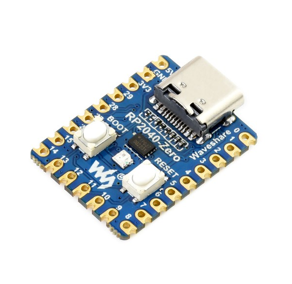
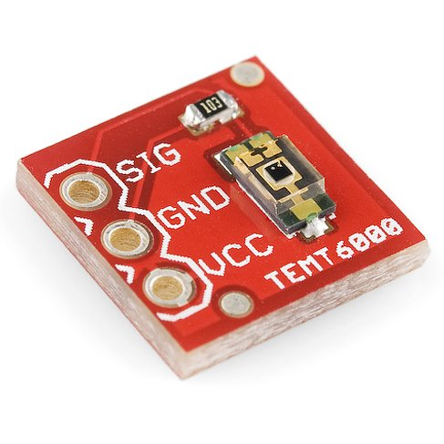
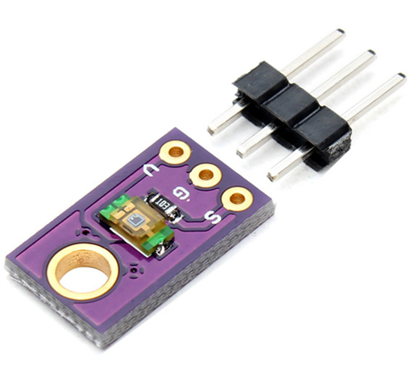
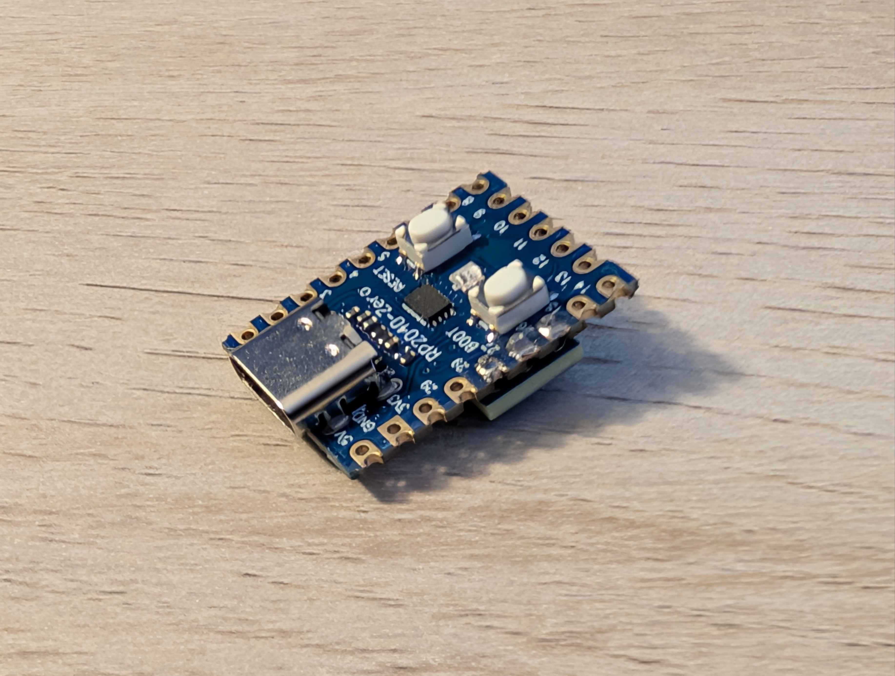
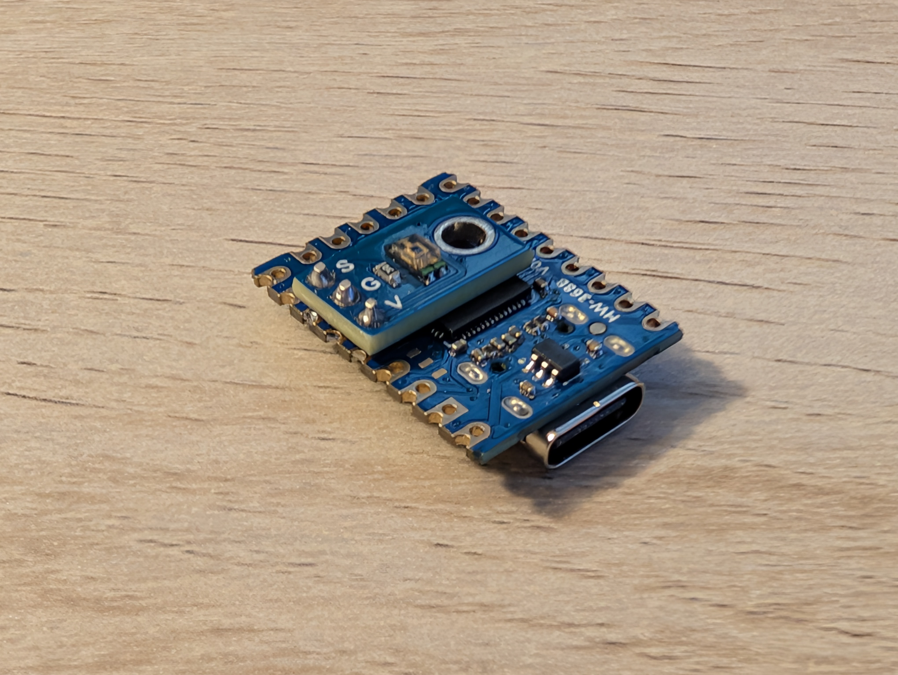

# RP2040 USB HID Ambient Light Sensor

Plug-and-Play USB HID Ambient Light Sensor (ALS) using a Raspberry Pi RP2040 microcontroller. 

You can use this sensor with [Clight](https://github.com/FedeDP/Clight) to automatically control the brightness of your DDC-compliant monitor in Linux (Practially all DisplayPort and HDMI Monitors).

As an HID sensor, it is automatically detected by Windows, Linux and MacOS. A simple user-space application or script should be able to extend the automatic brightness functionality to other operating systems, but as of now I'm unsure if such projects exist.

### Requirements

- Raspberry Pi RP2040 microcontroller board. 
I recommend a [Waveshare RP2040-Zero](https://www.waveshare.com/rp2040-zero.htm) but really, any RP2040 board you can get hold of, for example the Raspberry Pi Pico.



- TEMT6000 Light Sensor in a breakout board. Widely available from retail sources, including SparkFun and eBay.

&nbsp;

- Soldering iron and headers.

### Instructions

1. Solder the TEMT6000 to the RP2040 board. The Signal goes to pin 26, ground to 27 and Vcc to 28. If you are using the RP2040-Zero or Pi Pico boards, proceed to step 2.
   - If you have a board where pins 26, 27 and 28 are not adjacent, you will either have to do a more elaborate wiring, or edit `main.c` with the GPIO pin numbers you use and compile the firmware following the instructions in the next section. 
   - Please note that the Signal pin has to be connected to the chip's ADC, which can only read from GPIO pins 26, 27, 28 or 29.
   - **Important Note: The TEMT6000 sensor recommends an operating voltage of up to 5V, but you should supply at most 3.3 V to Vcc. This is because the ADC of the RP2040 is referenced to 3.3 V, and a higher voltage might damage the chip.**
   - Tidbit: Since the sensor draws at most about 0.5 mA, it is safe to power it from a GPIO Pin.

 

2. While holding the bootsel button on the RP2040-Zero board, connect it to your PC. The device should appear as a USB mass storage device. Drag and drop the .uf2 file from the [github releases](https://github.com/thariq-shanavas/RP2040_USBHID_Ambient-Light-Sensor/releases) to the mass storage device. If the device doesn't automatically reboot, simply unplug and re-plug it again.
3. You can check the live sensor readings via `cat /sys/bus/iio/devices/iio\:device0/in_illuminance_raw`. Without a case, the bare sensor tops out at about 660 Lux. Which isn't very much, but it's more than plenty for meaningful automatic brightness adjustment.
4. That's it, you're done! You may now set up [Clight](https://github.com/FedeDP/Clight) for automatic brightness adjustment, or write your own script that uses `ddcutil` to adjust display brightness.

### Building

You only need to follow this section if you are a developer or otherwise seeking to modify the firmware. For using the sensor, please download the pre-compiled firmware from [github releases](https://github.com/thariq-shanavas/RP2040_USBHID_Ambient-Light-Sensor/releases) and follow the instructions in the previous section.

**Option A: Build Script**

1. ```bash
   sudo apt update
   sudo apt install cmake gcc-arm-none-eabi libnewlib-arm-none-eabi build-essential
   git clone https://github.com/thariq-shanavas/RP2040_USBHID_Ambient-Light-Sensor
   cd RP2040_USBHID_Ambient-Light-Sensor
   ./build.sh
   ```

**Option B: Manual Build**

1. Install the Pico SDK:
   ```bash
   git clone https://github.com/raspberrypi/pico-sdk.git
   cd pico-sdk
   git submodule update --init
   export PICO_SDK_PATH=/path/to/pico-sdk
   ```

2. Install build tools:
   ```bash
   sudo apt update
   sudo apt install cmake gcc-arm-none-eabi libnewlib-arm-none-eabi build-essential
   ```

3. Compile

   ```bash
   mkdir build
   cd build
   cmake ..
   make -j4
   ```

### Clight Instructions

You can launch Clight from the command line using the `-d "iio:device0" ` flag to test if your monitor responds correctly to changing brightness. If you're happy, you may make the changes permanent by editing `/etc/clight/modules.conf.d/sensor.conf`.


```bash
$ sudo nano /etc/clight/modules.conf.d/sensor.conf
sensor:
{
   devname = "iio:device0";
};
```


### Help Wanted

There are some yaks in need of shaving. If you have the time, expertise, and resources, I'd sincerely appreciate your help here.

1. There is currently a factor of 3 disagreement between the sensor reading (calibrated from the TEMT6000 datasheet) and what the Lux meter on my phone says. I'm inclined to believe the datasheet, but if you have access to a real lux meter, I'd appreciate some calibration data.

2. It would be nice to have a 3D printed enclosure for ease of handling. If you have the abiliy to make some STL files I'll be glad to inclde them in this repo.

## Advanced Internals and Notes

A [USB HID device](https://learn.adafruit.com/customizing-usb-devices-in-circuitpython/hid-devices) announces its capabilities to your PC using an [HID descriptor](https://eleccelerator.com/tutorial-about-usb-hid-report-descriptors/). However, HID descriptors are fairly challenging to write manually. [Waratah](https://github.com/microsoft/hidtools) is a tool from Microsoft that can convert a high-level description of the reports to an HID descriptor. The HID descriptor for this project was generated using `als_hid_sensor.wara`, included in this repository.

Depending on the type of sensor you are building, it may be improtant to include feature reports in your HID descriptor. An ALS sensor, for instance, requires the following reports:
- Input Reports: Illuminance, Sensor Event
- Feature Reports: Reporting State, Power State and Report Interval

If you do not include all the required reports, the operating system will fail to enumerate the device properly. For reference, see the official [documentation](https://www.usb.org/sites/default/files/hut1_4.pdf) for the HID standard. I could not find a good reference for which reports are absolutely necessary for each sensor type, so I determined the required reports using some trial and error.

I initially started this project in CircuitPython, but soon ran into limitations on CircuitPython's ability to handle feature reports.

CircuitPython's HID implementation uses a polling-based buffer system. It stores incoming feature reports (SET_REPORT requests from the host) in memory buffers that must be checked repeatedly by the program. You can only queue one outgoing (device to host) report at a time, and there doesn't appear to be a way to check if the data in the buffer has been read by the host.

When the host computer (the PC) requested a feature report using GET_REPORT, CircuitPython would send the buffered report. However, if the host issued a second GET_REPORT request before I had a chance to refill that buffer with fresh data, CircuitPython would return whatever garbage data happened to be in memory at that location. This resulted in an unreliable communication between the sensor and the host.

While there might be workarounds to handle CircuitPython's buffered approach, I found it more straightforward to switch to TinyUSB instead.

TinyUSB uses an interrupt-driven architecture. Instead of the program constantly checking buffers for new requests, TinyUSB relies on hardware interrupts. When the host requests a report, the hardware immediately triggers an interrupt that pauses normal program execution and handles the request right away. This approach ensures that every request is serviced immediately with current data, eliminating the possibility of returning stale or garbage values.

Nevetheless, building an HID device using CircuitPython has been an invaluable teaching tool. I decided to include my CircuitPython code in this repository to document the journey.

## Credits

Many thanks to the wonderful folks who built CircuitPython, Clight and TinyUSB.
